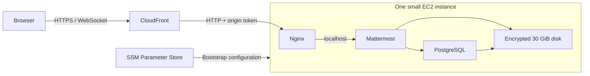

# Mattermost demo · StackRepeat blueprint

[](https://github.com/StackRepeat/aws-mattermost-blueprint/actions/workflows/checks.yml)

A small, hands-off [Mattermost](https://github.com/mattermost/mattermost) deployment
for demonstrating the StackRepeat platform. **No required inputs, domain purchase,
SSH keys, or manual server setup.** Deployment creates a public HTTPS URL, an
administrator, and a private **StackRepeat Demo** team.

Built from [StackRepeat/aws-blueprint-template](https://github.com/StackRepeat/aws-blueprint-template)
at `dc3bc288ea85603abc90efaf819e746a4b50eb8c`. One repository, one public blueprint.

## What it creates



- One `t3a.small` (2 vCPU, 2 GiB RAM), Amazon Linux 2023, and 2 GiB swap.
- Mattermost Team Edition and PostgreSQL in pinned official Docker images.
- One public subnet, an internet gateway, and a stable Elastic IP.
- CloudFront's supplied `https://….cloudfront.net` address and certificate.
- Nginx accepts requests from CloudFront with this deployment's origin token.
  Mattermost binds only to localhost; PostgreSQL has no published port. Browser
  traffic uses HTTPS; the CloudFront-to-origin connection uses HTTP.
- An encrypted disk, generated credentials in SSM SecureString, and Session Manager
  access. SSH is closed. No load balancer, NAT gateway, RDS, or paid DNS zone.

CloudFront forwards cookies, authorization, query strings and WebSocket headers;
application caching is disabled. Bootstrap closes public sign-ups before the
first start and opens the proxy only after creating the admin and team.

## Use in the public catalogue

| Field | Value |
| --- | --- |
| Source repository | `https://github.com/StackRepeat/aws-mattermost-blueprint` |
| Release reference | `v0.1.0` (resolve and pin its commit when importing) |
| Manifest | `stack-repeat-blueprint.json` |
| Blueprint ID | `blueprint:mattermost-demo` |
| Visibility | Public |
| Terraform root | `terraform` |
| Required inputs | None |
| Workload URL output | `endpoint` |

Import the repository manifest and publish a catalogue release pinned to its
commit. Deploy in an **approved demo scope whose effective policies permit public
HTTPS ingress**. Secure Foundation v1 does not support this public blueprint;
its restrictions remain enforced.

Automatic **Open workload** linking uses the endpoint reporting change merged in
[AWS runtime PR #72](https://github.com/StackRepeat/aws-platform/pull/72)
(`24abaca75858a661ee1658467274e5e86a37f2ab`). It reads Terraform's non-sensitive
`endpoint` output after a successful post hook. Publish a runtime release containing
that commit and upgrade both the executor buildspec and runtime Lambda image.
Runtime `v2.3.57` predates the change. An older
runtime still prints the real URL in build logs, but may attach its AWS Console
fallback to the workload. See [runtime integration](docs/runtime-integration.md).

The template's backend and provider Jinja files are preserved. The platform
supplies the state backend, region and target-account role, and projects request
inputs into Terraform. The provisioning role needs EC2/VPC, IAM, SSM and
CloudFront permissions. Initial downloads require outbound access to Amazon
Linux repositories, GitHub and Docker Hub.

### Open and sign in

1. Deploy the catalogue release. Allow roughly **10–20 minutes** for CloudFront,
   container downloads and startup. The post hook waits for the public API and
   fails the deployment if it never becomes healthy.
2. Open the workload's `endpoint` URL and sign in as **`demo-admin`**.
3. Retrieve the generated password from the workload account's SSM parameter
   named by `admin_credentials_parameter`. Its JSON `password` field is the
   login password. The parameter also contains the proxy token; keep it private.

For example, using an authorized AWS profile for that workload account:

```bash
aws ssm get-parameter \
  --region "$(terraform -chdir=terraform output -raw aws_region)" \
  --name "$(terraform -chdir=terraform output -raw admin_credentials_parameter)" \
  --with-decryption --query Parameter.Value --output text | jq -r .password
```

The password is never a Terraform output or printed in deployment logs. Terraform
state does contain generated secrets, so keep the platform's protected backend.
Public registration, plugins/calls, email notifications and email verification
are disabled for this demo. Create any additional users through the administrator
or local `mmctl`; SMTP is not configured for invitations or password recovery.

## Cost

Approximate **US East (N. Virginia), Linux On-Demand**, 730 hours/month, before
tax and traffic, checked September 2026:

| Resource | Approximate monthly cost |
| --- | ---: |
| `t3a.small` at $0.0188/hour | $13.72 |
| One public IPv4 at $0.005/hour | $3.65 |
| 30 GiB gp3 at $0.08/GiB-month | $2.40 |
| **Baseline** | **$19.77/month** |

Roughly **$0.03/hour** while deployed. Region prices vary. CloudFront requests
and transfer, EC2 egress, and any account/platform baseline services are additional;
small demos may fit available CloudFront free allowances. No free allowance is
assumed in the baseline above. Sources: [EC2 T3a](https://aws.amazon.com/ec2/instance-types/t3/),
[public IPv4](https://aws.amazon.com/vpc/pricing/), [EBS](https://aws.amazon.com/ebs/pricing/),
[CloudFront](https://aws.amazon.com/cloudfront/pricing/).

CPU credit mode is `standard` to avoid surplus credit charges. Sustained activity
can be throttled. Logs rotate locally, and the demo uses one server without
autoscaling. **Destroy the workload when the demo ends**: stopping only the
instance leaves disk and public-IP charges. Destroy also removes the distribution,
disk, IP, parameters and networking; CloudFront removal can take several minutes.

## Inputs and outputs

The only optional input is `instance_type`, default `t3a.small`. Supported values
are `t3a.small`, `t3.small`, `t3a.medium`, and `t3.medium`. Use `t3.small` in a region
without T3a, or a medium size for a busier demonstration. ARM instances are not
supported by this implementation.

| Output | Purpose |
| --- | --- |
| `endpoint` | Public HTTPS URL for the workload |
| `admin_username` | `demo-admin` |
| `admin_credentials_parameter` | Reference to the SSM SecureString credential |
| `aws_region` | Region for credential retrieval and management |
| `instance_id` | Session Manager and troubleshooting target |

## Lifecycle and demo limits

**Create:** installs Docker and Nginx, verifies the pinned Compose download,
waits for its CloudFront URL in SSM, generates a local database password, starts
the containers, creates the administrator/team, then enables public access.
Bootstrap retries transient failures and runs again after reboots. Containers
restart automatically after process exits or host restarts.

**Update:** the catalogue does not advertise an update operation because the
current workload runtime supports create and destroy. Standalone Terraform can
resize the instance while preserving the root disk; a newly released AMI alone
does not silently replace the server.
Changing the bootstrap or image pins **replaces the instance and resets demo
data**. Inspect the plan before updating. A new release is not an automatic
in-place database migration.

**Destroy:** deletes the instance, all local messages/uploads/database data and
the rest of this blueprint's resources. There are no retained backups.

This is for short, low-traffic demonstrations. It has one failure domain,
local storage, no backups, no managed application upgrades, and no production
availability commitment. Reboots preserve data; instance replacement and destroy
do not. Change the initial password after retrieval if the demo will be shared.
The SSM credential remains the initial password if it is later changed in the UI.

## Run without the platform

With Terraform 1.15.9, AWS CLI credentials for a suitable test account, and an
approved region:

```bash
export AWS_REGION=us-east-1
terraform -chdir=terraform init
terraform -chdir=terraform apply
WORKLOAD_ACTION=create bash api_helpers/post-api-helpers.sh
terraform -chdir=terraform output -raw endpoint

# Clean up when finished; deletes demo data.
terraform -chdir=terraform destroy
```

Do not commit generated state, provider/backend files or populated variable files.
The readiness hook requires Python 3 and uses only its standard library.

## Troubleshooting

Use Session Manager for the exported `instance_id`, then:

```bash
sudo journalctl -u stackrepeat-mattermost.service --no-pager -n 100
sudo systemctl restart stackrepeat-mattermost.service
sudo sh -c 'cd /opt/stackrepeat && docker compose ps'
```

If bootstrap exhausted its automatic retries, run
`sudo systemctl reset-failed stackrepeat-mattermost.service` before restarting.
A failed readiness hook leaves resources running for diagnosis; retry or destroy
them to stop charges. Avoid printing `.env`, `postgres-password`, credential
parameters or full container environment settings in shared logs.

## Validation

```bash
make test          # Manifest, format, Terraform validate, mocked plan and readiness tests
make smoke-docker # Real pinned images: bootstrap, login, registration block and restart
```

`make test` creates no AWS resources and is run by GitHub Actions. The opt-in
Docker smoke test creates and removes its own temporary containers/volumes.
These checks verify the configuration and application bootstrap; a real AWS
deployment is still needed to validate account permissions, quotas, CloudFront
propagation and end-to-end platform execution.

## License

Blueprint code is [Mozilla Public License 2.0](LICENSE), inherited from the
template. Mattermost and the other upstream images retain their own licences;
this repository deploys them and does not redistribute their source.
